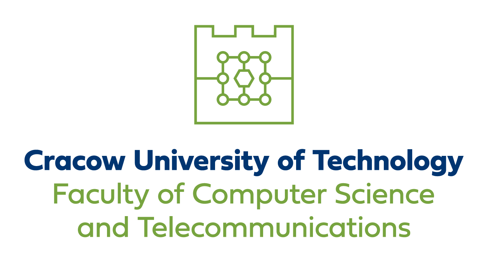

# `Analysis of attacks on language models`

- _Author_: `Bartosz Włodarski`
- _Supervisor_:
- _University_: `Cracow University of Technology`
- _Faculty_: `Faculty of Computer Science and Telecommunications`
- _Field of study_: `Computer Science`
- _Specialization_: `Cybersecurity`
- _Degree_: `Master of Engineering`
- _Language_: `English`
- _Year_: `2024-2025`

# Introduction to Language Models

1. **Definition of a Language Model**
2. **Capabilities of a Language Model**
3. **Why Language Models?** (Impact on Technology, Economy, and Society)
4. **History of Language Models**
   - Rule-based Natural Language Processing
   - Statistical Models
   - Neural Network-based Models
   - Transformer-based Models
   - Multimodal Models
5. **Deployment of Language Models**
6. **Challenges**
   - Computational Power Requirements
   - Training Costs
   - Errors and Hallucinations
7. **Threats and Risks of Using Language Models**

# Objectives of the Study

1. Discussion of the “OWASP Top 10 for LLM Applications 2025” list
2. Description of the environment used for testing attacks
3. Presentation of attacks on locally deployed language models
4. Presentation of defense techniques against attacks

# OWASP Top 10 for LLM Applications 2025

1. **What is the list and what are its goals?**
2. **Previous editions of the list**
3. **The Top 10 List:**
   - **LLM01:** Prompt Injection
   - **LLM02:** Sensitive Information Disclosure
   - **LLM03:** Supply Chain
   - **LLM04:** Data and Model Poisoning
   - **LLM05:** Improper Output Handling
   - **LLM06:** Excessive Agency
   - **LLM07:** System Prompt Leakage
   - **LLM08:** Vector and Embedding Weaknesses
   - **LLM09:** Misinformation
   - **LLM10:** Unbounded Consumption
4. **Summary: LLM Application Architecture with Possible Attack Vectors**

# Testing Environment

1. **Ollama**
   - Models repository
   - Python SDK
2. **OpenWebUI**
3. **Local Models**
   - LLama3
   - Mistral
   - Custom Models
   - Why self-hosted models?
4. **Hardware**

# Attacks on Language Models

1. Basic Prompt Injection
2. Prompt Leak
3. Jailbreak via Role-Playing
4. Reverse Prompt Injection
5. Token Smuggling
6. Unicode Trickery
7. Semantic Redirection
8. Context Misdirection
9. Multi-Prompt Simulation
10. Code Completion Attack

# Defense Techniques Against Attacks on Language Models

1. **Sanitized Prompting**
   - Simple Example
   - Secure Finance Assistant
2. **Output Filtering**
   - Simple Filter
   - Data Sanitization Agent
3. **Rate Limiting**
4. **Intent Detection**
5. **Watermarking**

# Summary

1. Main Attack Vectors
2. Effectiveness of Defense Mechanisms
3. Challenges in Securing Language Models
4. Future Directions and Research Areas
