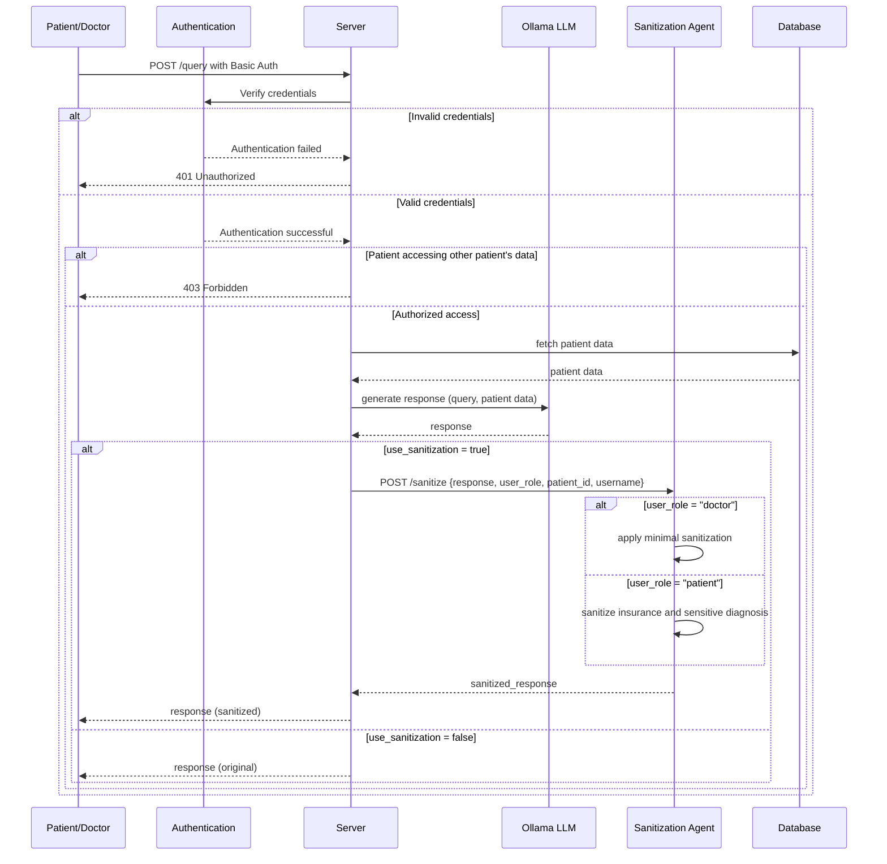

### README: Secure Medical Data Management System with LLM Integration

#### Description

This application demonstrates a secure medical information system that leverages a Large Language Model (Ollama with LLama 3) for answering medical queries, while implementing several key security features:

1. **Role-Based Access Control**: Different user types (patients, doctors) have different access levels to data
2. **Basic Authentication**: All API requests require valid credentials
3. **Output Sanitization**: Medical data is filtered and sanitized based on the user's role
4. **LLM Integration**: Uses Ollama to power natural language interactions

#### System Components

1. **API Server (Flask)** – The server authenticates users, authorizes access to patient data, and manages the flow between clients, LLM, and the sanitization agent.
2. **Ollama LLM** – Processes natural language queries and generates informative responses based on patient data.
3. **Sanitization Agent (Flask)** – Receives responses from the API server, filters sensitive data according to the user's role, and returns the sanitized response.
4. **User Database** – Contains user credentials, roles (patient/doctor), and associations with patient IDs.
5. **Patient Database** – Stores patient medical records.

#### User Roles

- **Patients**: Can only access their own medical records, with some sensitive information (like insurance numbers) redacted
- **Doctors**: Can access all patient records with fewer restrictions

#### Architecture



#### How it Works

1. The user (patient or doctor) sends a query to the API server with their credentials.
2. The server authenticates the user and verifies their authorization to access the requested patient data.
3. For patients, access is restricted to their own records. For doctors, access is granted to all patient records.
4. The query is processed by the Ollama LLM, which generates a natural language response based on the patient data.
5. If sanitization is enabled, the response is sent to the sanitization agent.
6. The sanitization agent applies different levels of filtering based on the user's role:
   - For patients: More aggressive filtering, removing insurance numbers and detailed diagnosis information
   - For doctors: Minimal filtering, allowing most medical information to pass through
7. The sanitized response is returned to the user.

#### Security Features

1. **Authentication**: HTTP Basic Authentication verifies user identity.
2. **Authorization**: Role-based access control ensures patients can only see their own data.
3. **Data Sanitization**: Context-aware filtering based on:
   - User role (patient vs doctor)
   - Data type (diagnosis, insurance number, etc.)
4. **LLM Guidance**: System prompts instruct the LLM to maintain patient confidentiality.

#### Getting Started

1. Install required packages:

   ```
   pip install flask requests
   ```

2. Ensure Ollama is installed and running.

3. Run the setup script:
   ```
   bash run.sh
   ```

This will:

- Create the Ollama model using the provided Modelfile
- Start both the server and sanitization agent
- Run test queries demonstrating the system's functionality

#### Testing

The included test script (`run.sh`) demonstrates various scenarios:

1. Patient accessing their own data (authorized)
2. Patient trying to access another patient's data (unauthorized)
3. Doctor accessing patient data (authorized)
4. Doctor accessing data with sanitization disabled
5. Unauthenticated request attempt

#### Example Sanitized Response

The following is an example of a sanitized response from the system when a doctor accesses a patient's record with sanitization enabled:

```
Here is Michael Johnson's full patient record:

**Patient Information**

* Name: Michael Johnson
* Age: 52
* Blood Type: B+

**Medical History**

* Diagnosis:
	+ Hypertension
	+ High Cholesterol

**Medications**

* Lisinopril
* Atorvastatin

**Insurance Information**

* Insurance Number: <<REDACTED INSURANCE_NUMBER>>
```

Note how the system has redacted the sensitive insurance number while preserving the rest of the medical information that doctors are authorized to see.
