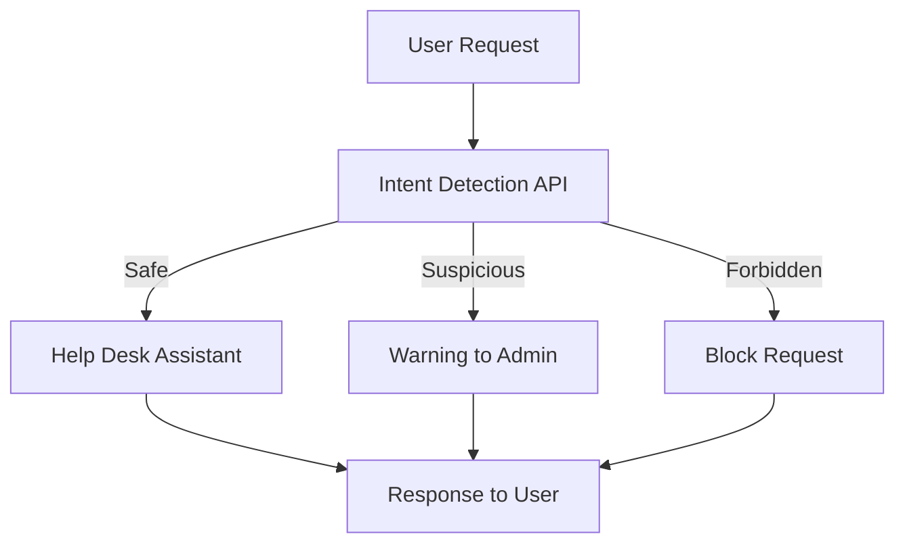

# Intent Detection Experiment with Help Desk System

This repository demonstrates an experiment where we build a **Help Desk Assistant** using LLaMA 3 and apply **Intent Detection** to block malicious or suspicious requests.

## Architecture Overview

1. Intent Detection API: This component uses spaCy to analyze user requests and determine if the request is "safe", "suspicious", or "forbidden". Intent is detedcted by `spaCy` and classified into three categories:
   Safe: Requests that are considered legitimate.
   Suspicious: Requests that might indicate a user trying to bypass security or perform unauthorized actions.
   Forbidden: Requests containing forbidden activities such as hacking or malicious software creation.
2. Help Desk Assistant (LLaMA 3): Once the request is classified as safe, it is passed to the LLaMA-based Help Desk assistant, which provides a response.
   Experiment Flow
   The experiment follows this sequence of steps:

Model Creation: A custom LLaMA 3 model is created from a Modelfile to act as the help desk assistant.
Server Setup: A Flask-based server (server.py) is used to handle user requests.
Intent Detection: An intent detection service (intent_detector.py) analyzes incoming requests and classifies them.
Testing: Multiple test requests are sent to the server, including some potentially malicious or suspicious ones, to verify the effectiveness of intent detection.
Logging Results: The results are logged and saved in results.txt, which shows the classification of each test request.
