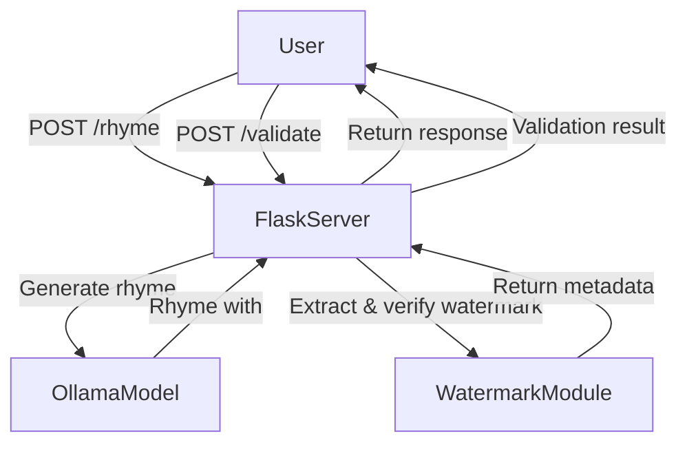

# TODO - AI Rhyme Generator with Digital Watermarking

## Overview

This project is an **AI-powered rhyme generator** that ensures authorship using **invisible watermarking**.  
It provides:

- **Secure user authentication** (Basic Auth)
- **Digital watermark embedding** (encoded in whitespace)
- **Rhyme validation** (to verify authorship)

## 📌 Architecture

